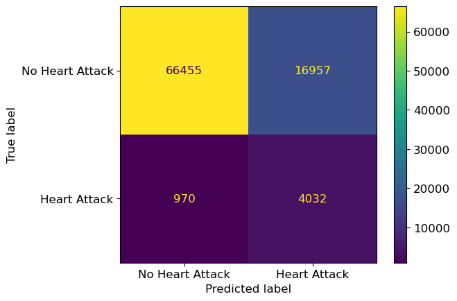
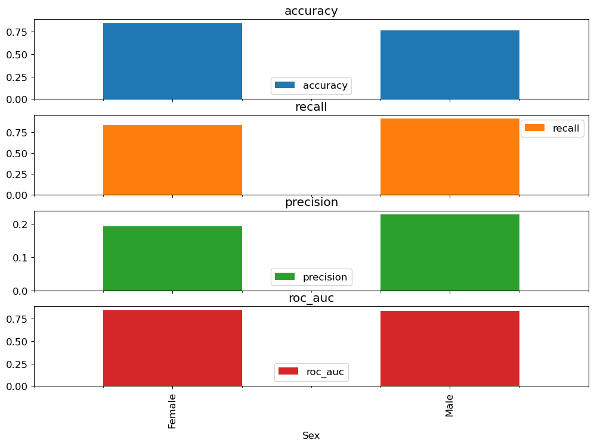
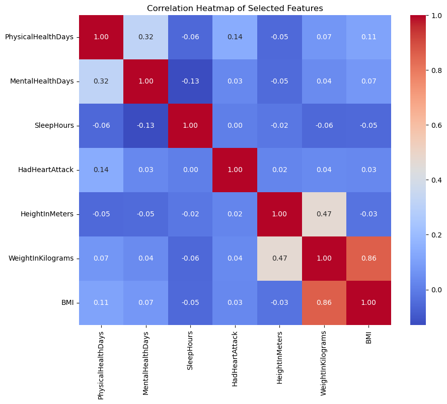
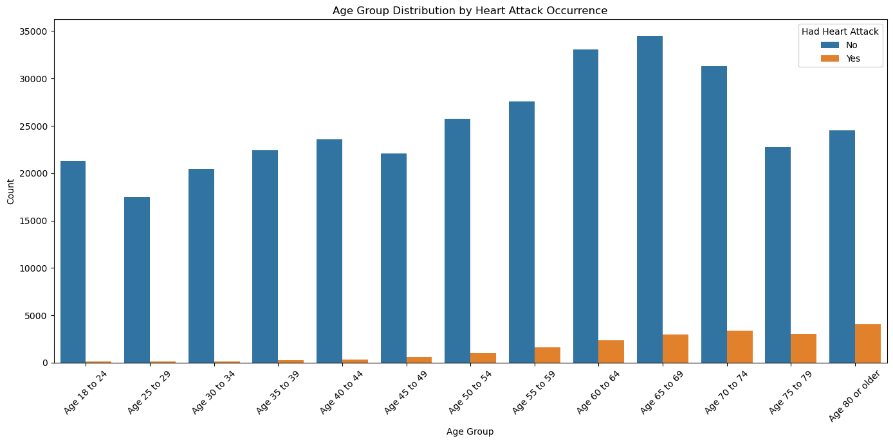

# Heart Attack Risk Prediction

**Predicting heart-attack risk from CDC BRFSS health-indicator data using a Random Forest with RFECV feature selection, class-imbalance handling, and a Fairlearn audit. MBAN capstone project — team of four.**

This is my end-to-end classifier on the Kaggle "Personal Key Indicators of Heart Disease" dataset (CDC BRFSS, 356,105 rows, 40 features). It compares eight model configurations on ROC AUC, tunes the winner with grid search, audits fairness across sex, and outputs Low / Medium / High risk buckets for downstream triage.



---

## Why this problem

Cardiovascular disease is the leading cause of death globally. The [CDC](https://www.cdc.gov/heartdisease/facts.htm) puts it at one death every 33 seconds in the US, and roughly 47% of Americans have at least one of the three primary risk factors (high blood pressure, high cholesterol, smoking). The [NHLBI's Framingham work](https://www.nhlbi.nih.gov/science/framingham-heart-study-fhs) has been pointing at obesity, sedentary lifestyle, and smoking as the dominant levers for decades.

The challenge from a modelling perspective: the dataset is severely imbalanced (~10% positive). A naive classifier that always predicts "No" gets ~89% accuracy and is useless. We need a model that *ranks* patients by risk well, not one that optimises accuracy. That reframe drives every decision downstream — scoring metric, resampling strategy, final confusion-matrix interpretation.

The fictional client for the capstone was Star City General Hospital. Business value came from three verticals:

1. **Legal / liability** — catching high-risk patients early as a malpractice-risk hedge.
2. **Resource allocation** — routing scarce cardiology capacity (cath labs, referrals, follow-up screenings) to patients who actually need it.
3. **New revenue stream** — selling wellness-program insight to employers based on the local population's risk-factor profile.

## The pipeline

One representative snippet — `SMOTE` + `RFECV` + `GridSearchCV` stacked inside a single sklearn-compatible pipeline so resampling never leaks into held-out folds:

```python
from imblearn.pipeline import Pipeline
from imblearn.over_sampling import SMOTE
from sklearn.feature_selection import RFECV
from sklearn.ensemble import RandomForestClassifier, ExtraTreesClassifier
from sklearn.model_selection import GridSearchCV

pipe = Pipeline([
    ("preprocessor", preprocessor),
    ("sampler", SMOTE(random_state=42)),
    ("feature_selector", RFECV(
        estimator=ExtraTreesClassifier(random_state=42),
        cv=3, scoring="roc_auc")),
    ("classifier", RandomForestClassifier(random_state=42)),
])
grid = GridSearchCV(pipe, param_grid, cv=5, scoring="roc_auc", n_jobs=-1)
```

- **Data:** CDC BRFSS Key Indicators of Heart Disease (Kaggle, `kamilpytlak/personal-key-indicators-of-heart-disease`)
- **Preprocessing:** `ColumnTransformer` — median imputation + scaling for numeric, most-frequent imputation + one-hot for categorical, explicit ordinal maps for `GeneralHealth`, `AgeCategory`, `HadDiabetes`, `CovidPos`, `TetanusLast10Tdap`
- **Class imbalance:** compared undersampling vs SMOTE. Undersampling won for the main training loop because the dataset is already large (synthetic samples would balloon training time without an obvious accuracy win). SMOTE was used inside the final grid-search pipeline where the imblearn pipeline prevents fold leakage.
- **Feature selection:** Recursive Feature Elimination with Cross-Validation (`RFECV`) driven by `ExtraTreesClassifier` — picks feature count automatically, handles interactions, fast.
- **Models compared:** Dummy, Logistic Regression (balanced + unbalanced), KNN, Decision Tree, SVM, Gaussian NB, Random Forest (balanced + unbalanced)
- **Tuning:** `GridSearchCV` over `min_samples_split` and `min_samples_leaf`
- **Fairness audit:** `fairlearn` metrics (accuracy, recall, precision, ROC AUC) stratified by sex
- **Risk tiering:** predicted probability bucketed into Low (<0.5), Medium (0.5–0.7), High (>0.7)

## Why ROC AUC, not accuracy

Accuracy is misleading on imbalanced data. A "predict No always" classifier hits 89% here and is worthless. ROC AUC measures how well the model *ranks* patients — independent of any single threshold. That's what the clinical workflow actually needs: the hospital can shift the threshold based on capacity week-to-week without retraining.

Recall on the positive class is also load-bearing. The cost of a missed high-risk patient is orders of magnitude worse than the cost of an unnecessary follow-up screening. ROC AUC captures that asymmetry without hard-coding a cutoff.

## Results

| Metric | Value |
|---|---|
| Final model | Tuned Random Forest (SMOTE + RFECV) |
| Test ROC AUC | **0.8014** |
| Training ROC AUC | 0.8448 |
| Best CV ROC AUC (grid search) | 0.8831 |
| Recall on Heart Attack class | 0.81 |
| Precision on Heart Attack class | 0.19 |
| F1 on Heart Attack class | 0.31 |
| Overall accuracy | 0.80 |
| Fairness — Female ROC AUC | 0.844 |
| Fairness — Male ROC AUC | 0.833 |

**Reading the confusion matrix honestly:** the model catches 81% of real heart-attack cases but only 19% of flagged patients are true positives. This is an aggressive over-alerting profile, deliberately so — missing a real case is much worse than ordering an extra screening. If the hospital wants to tighten the funnel, they raise the probability threshold and trade recall for precision.

CV ROC AUC across candidate models:

| Model | CV ROC AUC |
|---|---|
| Logistic Regression (unbalanced) | 0.884 |
| SVM (balanced) | 0.883 |
| Random Forest | 0.883 |
| Gaussian NB | 0.852 |
| Decision Tree | 0.851 |
| KNN | 0.793 |
| Dummy | 0.500 |

The top three landed within 0.001 of each other. Random Forest won on train/val consistency and deployment robustness — SVM had convergence warnings, Logistic Regression was the closest contender and would be my pick if the deployment environment was more constrained.

The class-balanced Random Forest variant did not outperform the standard one, so the simpler model was kept.

Fairness audit across sex showed accuracy, recall, precision, and ROC AUC within tight bounds between male and female subgroups — no material disparate performance. I did *not* run the same check across race/ethnicity because the smaller BRFSS subgroups don't have enough positive-class observations for stable point estimates; the right next step there is stratified bootstrap with confidence intervals, not a raw subgroup split.

## Key screenshots

| | |
|---|---|
|  |  |
| Confusion matrix — final Random Forest on full training set | Fairlearn audit — accuracy, recall, precision, ROC AUC by sex |
|  |  |
| Correlation heatmap — flagged `HeightInMeters` + `WeightInKilograms` vs `BMI` collinearity before RFECV | Heart-attack rate rises monotonically with age — the cleanest single predictor in the EDA |

## Risk tiering — what ships to the clinician

Raw probability is the wrong interface for a cardiologist. Three buckets is the right one:

- **Low risk (p < 0.5)** — routine care
- **Medium risk (0.5 ≤ p < 0.7)** — schedule a screening, monitor
- **High risk (p ≥ 0.7)** — proactive cardiology referral, flag for wellness-program enrolment

The distribution of patients across these tiers is heavily Low-skewed, which is the intended behaviour. The hospital doesn't want every patient flagged — it wants the top decile.

## Recommendations grounded in the EDA

1. Target high-BMI + poor-physical-health-days patients in wellness programs.
2. Promote physical activity as a standing benefit — the physically-active cohort shows a meaningfully lower heart-attack rate.
3. Age-focused screenings for the 65+ cohort (blood pressure, cholesterol, HbA1c).
4. Moderate alcohol messaging — the data here was counterintuitive but public-health guidance is unambiguous.
5. Mental-health support — `PhysicalHealthDays` and `MentalHealthDays` both correlate with the outcome.

## How to run

```bash
git clone https://github.com/ChetanSarda99/Machine_Learning_Project-HeartDiseasePrediction.git
cd Machine_Learning_Project-HeartDiseasePrediction
pip install pandas numpy seaborn matplotlib scikit-learn imbalanced-learn fairlearn shap jupyter
# download heart_2020_cleaned.csv from
#   https://www.kaggle.com/datasets/kamilpytlak/personal-key-indicators-of-heart-disease
jupyter notebook project_model.ipynb
```

## File structure

```
.
├── project_model.ipynb   # End-to-end pipeline: EDA, preprocessing, 8-model comparison, tuning, fairness, risk tiers
├── project_model.html    # Rendered notebook for quick viewing without Jupyter
├── Report.pdf            # Written report with methodology, results, and recommendations
├── screenshots/          # EDA, confusion matrix, fairness audit PNGs used in this README
└── README.md             # This file
```

## What I learned

- **Accuracy is a trap on imbalanced data.** I would have shipped a garbage 89%-accuracy model if I'd ignored ROC AUC. Every write-up says this; I had to actually get it wrong once to internalise it.
- **Undersampling was the right call for this dataset size, but it's dataset-specific.** On a 10K-row problem I'd be much more careful — undersampling throws away real data, which matters when data is the constraint. At 356K it genuinely doesn't.
- **Fairness checks feel like overhead until you need to explain the model to a hospital board.** Fairlearn took an hour to wire up and would have saved a week of back-and-forth in a real clinical deployment.
- **`Pipeline` + `ColumnTransformer` saved me once I moved from EDA to production-shape code.** The first draft had fit-on-everything bugs that silently inflated CV scores. Wrapping everything in a single sklearn-compatible pipeline made the leakage impossible.
- **Next time I'd try XGBoost or a calibrated Logistic-Regression ensemble.** This dataset isn't deeply nonlinear — the top three models landed within 0.001 ROC AUC. Gradient boosting might squeeze another percent; a well-calibrated LR would be easier to explain clinically.

## What's next

- Ensemble learning: stack LR + RF + XGBoost and see whether voting/stacking beats the single best model.
- Advanced feature engineering with clinical input — layering in actual lab values (LDL, HbA1c, resting BP) would likely push ROC AUC past 0.9.
- Deep-learning on a multi-year BRFSS sample with `TabNet` or `FT-Transformer`.
- Production deployment — FastAPI service on Vertex AI or AWS SageMaker, nightly batch scoring against the hospital's patient panel, risk tiers flowing into the cardiology team's EHR task list.

## References

- Dataset: [Kaggle — Personal Key Indicators of Heart Disease](https://www.kaggle.com/datasets/kamilpytlak/personal-key-indicators-of-heart-disease)
- [CDC heart disease facts](https://www.cdc.gov/heartdisease/facts.htm)
- [NHLBI Framingham Heart Study](https://www.nhlbi.nih.gov/science/framingham-heart-study-fhs)
- [Fairlearn](https://fairlearn.org/)
- [imbalanced-learn](https://imbalanced-learn.org/)

---

*Team: Chetan Sarda, Zixuan Zhu, Yinong Yao, Randeep Singh.*
